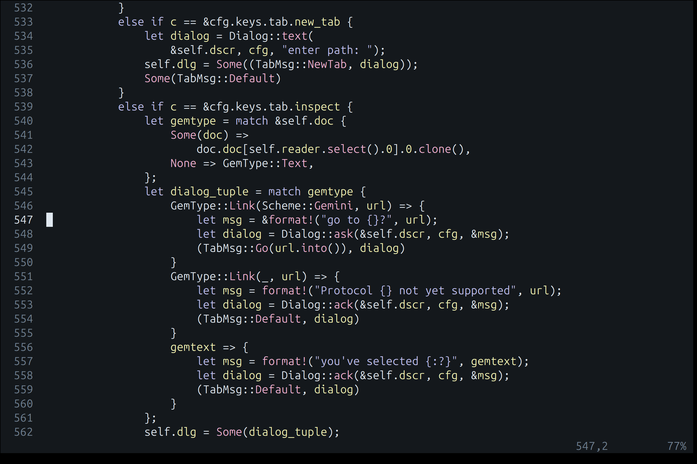
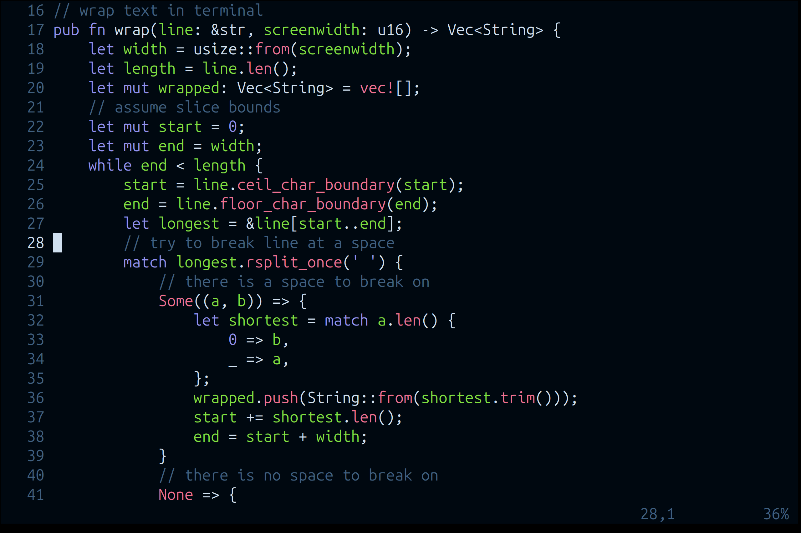

# neovim config

## Overview
Just comment out what you don't want. See ./init.lua for the top-level options, or go into the ./lua directory for finer control. 

If you aren't using a pearbear keyboard, you'll want to comment out the `require "pearbear-keymaps"` line from ./init.lua. But if you use a pearbear, you might start by going into ./lua/pearbear-keymaps.lua and modifying to taste from there.

## Dependencies
- LSP binaries located somewhere in your $PATH.
- Treesitter binaries located in ./parser

## Colorschemes
Note that these colorschemes use custom treesitter captures specified in the ./queries directory. 

### drunkbuzzlightyear

### smarties

### mosscave

