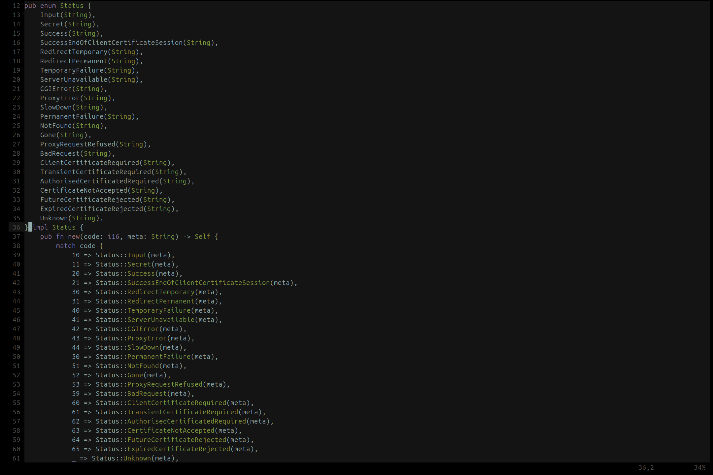
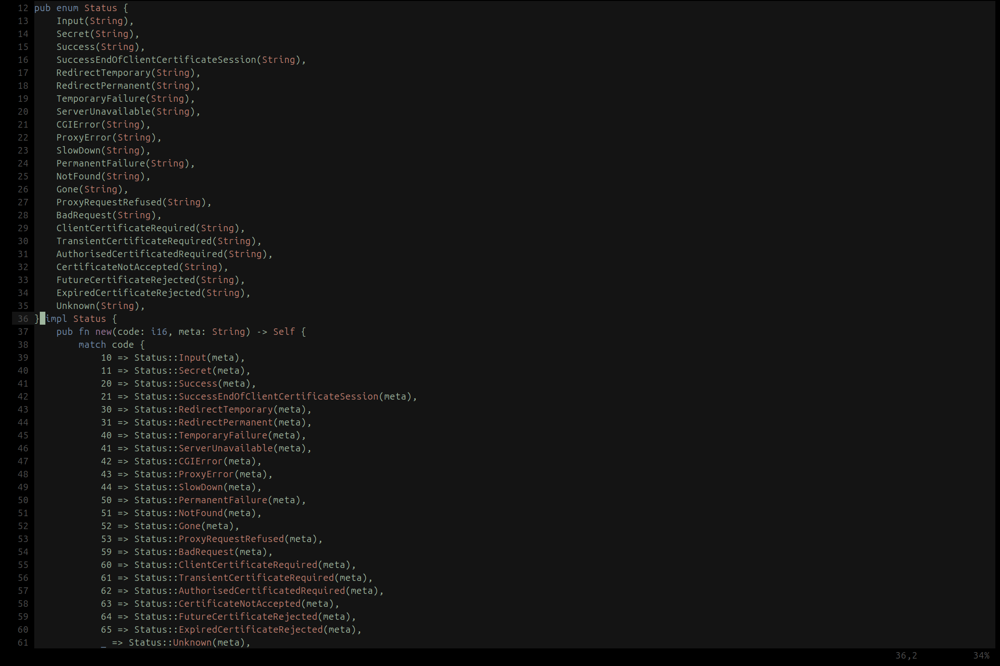
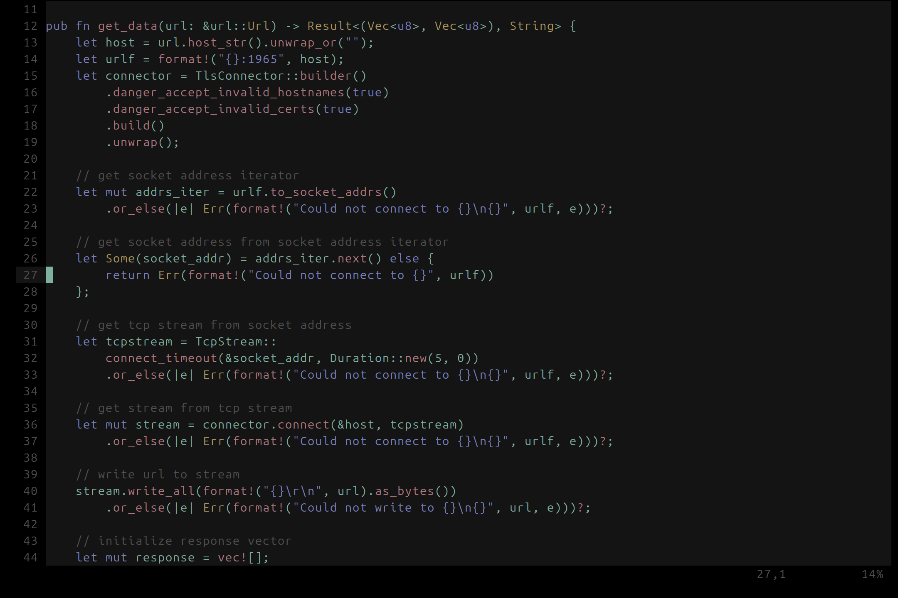

# neovim config

just comment-out what you dont want. see init.lua for the top-level options, or go into the lua directory for finer control.

to use the colorschemes, copy the following heirarchies into your nvim config directory:
- lua/tsad_colorscheme_main.lua
- colors/moss.lua
- colors/rose.lua
- colors/orange.lua
- queries/*

### moss colorscheme
  
  
  

### rose colorscheme
  
  
  

### orange colorscheme
  
  
  
