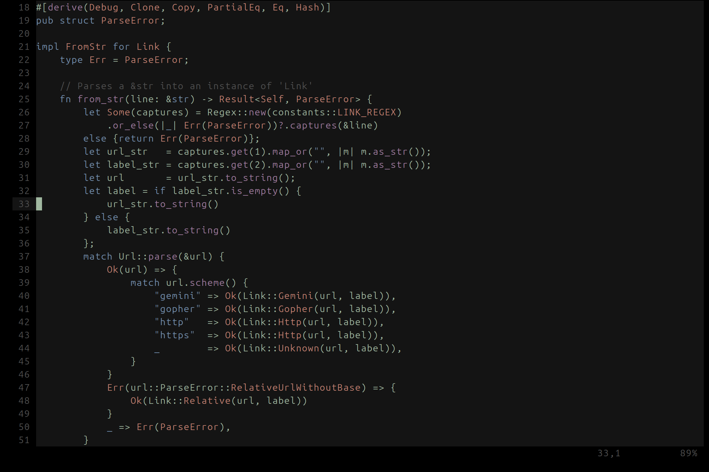
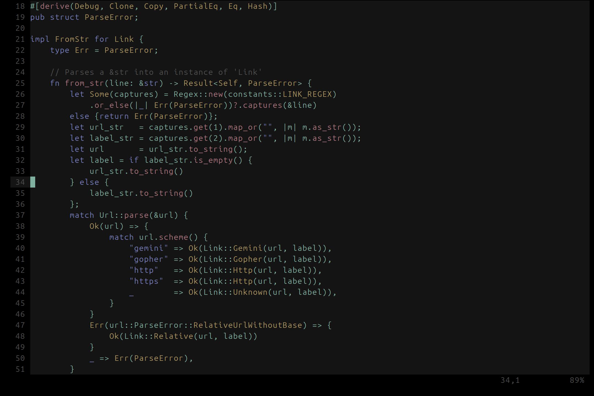

# neovim config

copy the following heirarchies into your nvim config directory
- lua/tsad_colorscheme_main.lua
- colors/moss.lua
- colors/rose.lua
- colors/orange.lua
- queries/*

### moss colorscheme
  
  
  

### rose colorscheme
  
  
  

### orange colorscheme
  
  
  
