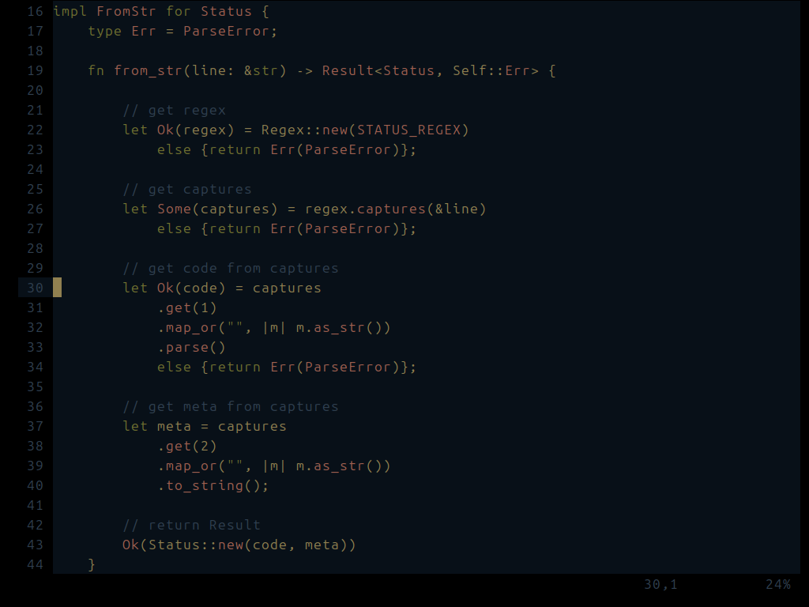
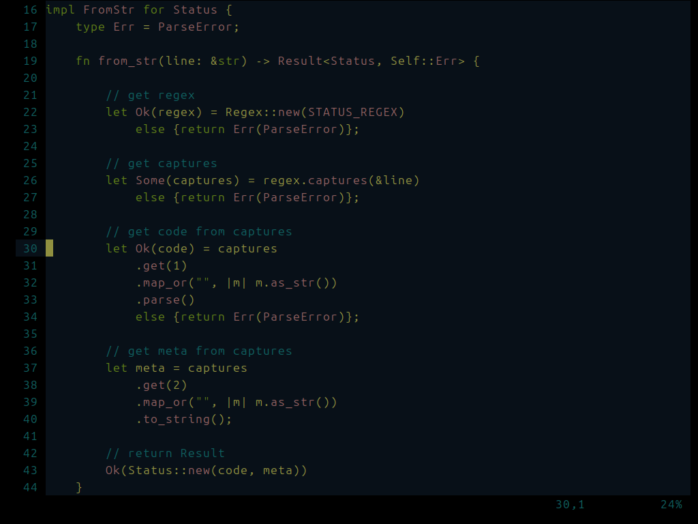
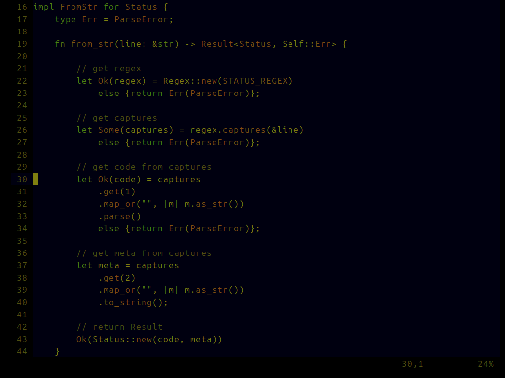
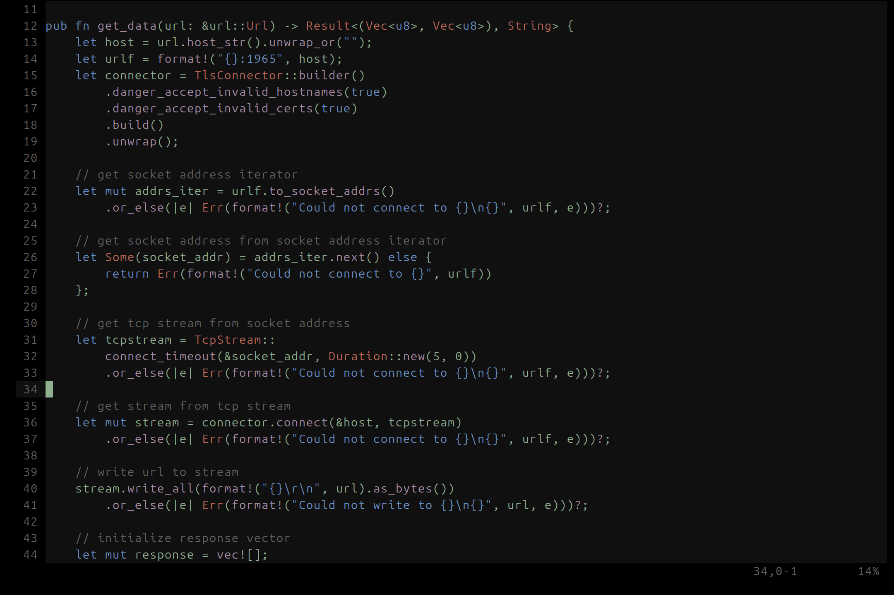
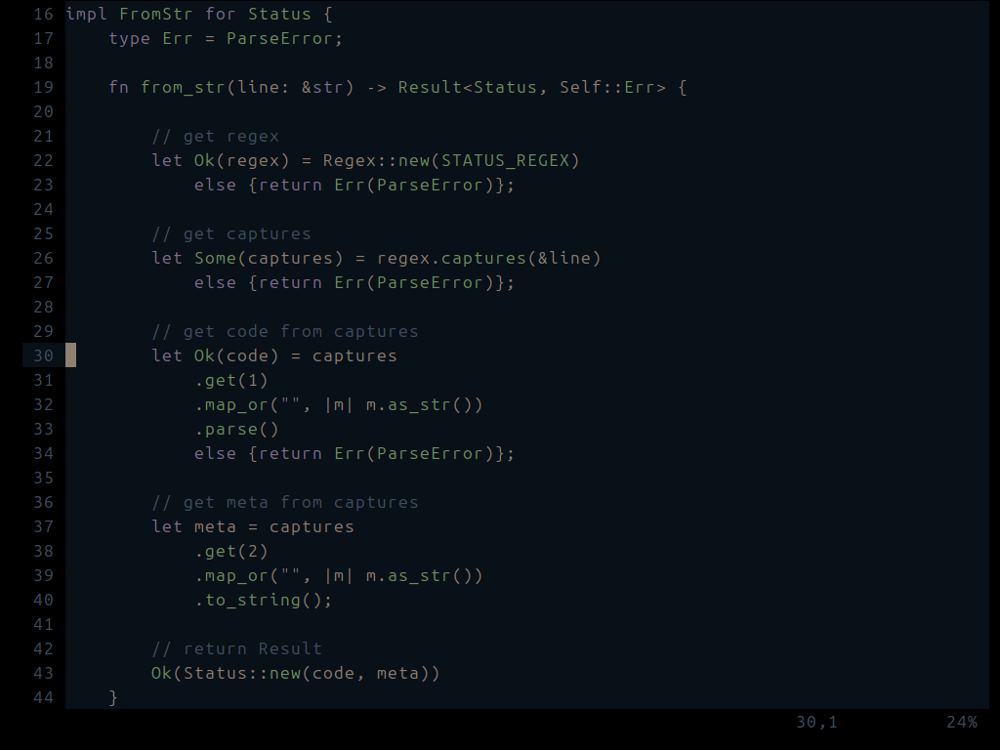
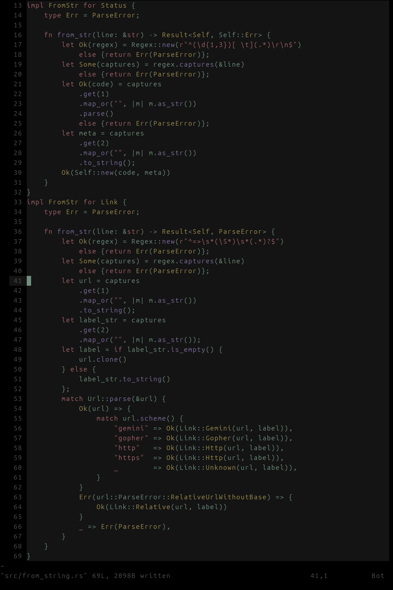

# neovim config

just comment-out what you dont want. see init.lua for the top-level options, or go into the lua directory for finer control.

to use the colorschemes, copy the following heirarchies into your nvim config directory:
- lua/tsad_colorscheme_main.lua
- colors/*
- queries/*

### leep colorscheme
  

### geep colorscheme
  

### yeep colorscheme
  

### deep colorscheme
  

### rose colorscheme
  

### lav colorscheme
  

### autumn colorscheme
  

### moss colorscheme
  

