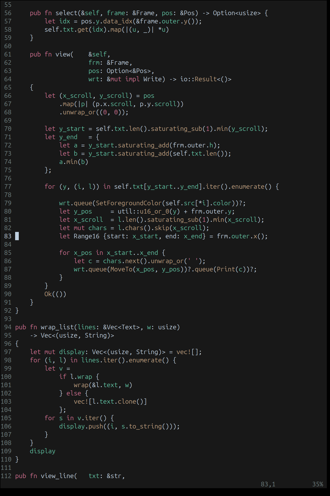
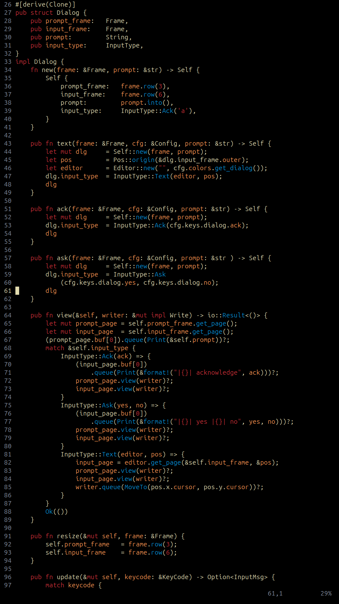
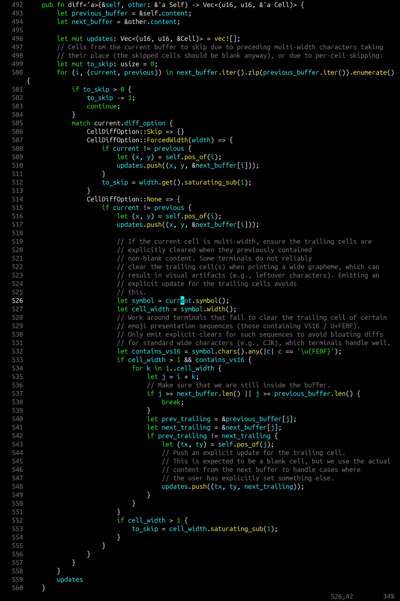
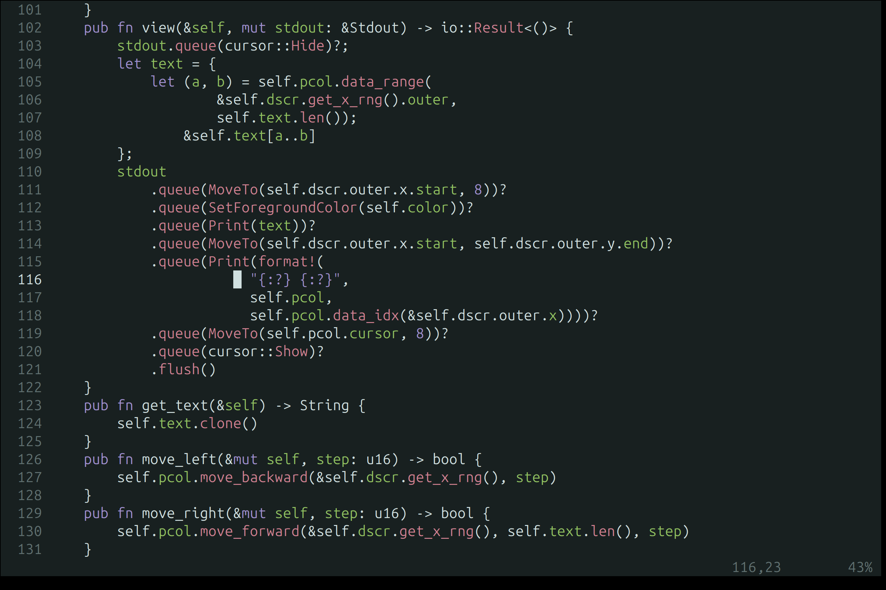

# neovim config

## Overview
The colorschemes herein follow a couple of guidelines that make for a balance between consistency and variety. The background and main text colors are close to greyscale, but tinted generally in a cooler direction like cyan or blue. There are three colorful colors used for highlighting. The three colors are nominally cyan, yellow, and magenta. Their hex values are adjusted to harmonize with the background. The variation between colorschemes function to meet the needs of various environments and times of day. Some schemes work best in my home office on a bright day. Some schemes work best in my work office on a grey day. To some people these things couldn't possibly matter, but for my nervous systemit so happens to matter a lot. If you're like me, maybe the work I've done here will make your life as a computer rat a bit easier.

## Dependencies
- LSP binaries located somewhere in your $PATH.
- Treesitter binaries located in ./parser

## Colorschemes

### feb

### allieofisherpallete3

### ygc

### drunkbuzzlightyear

