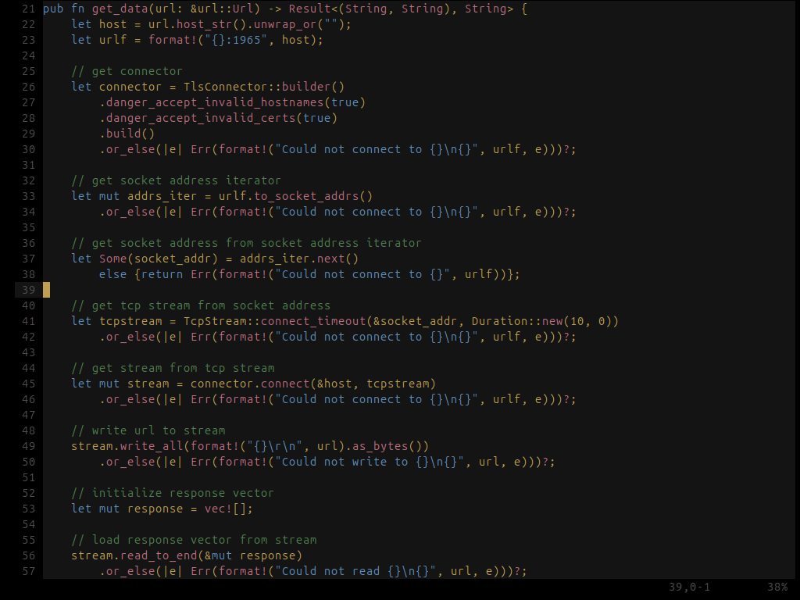
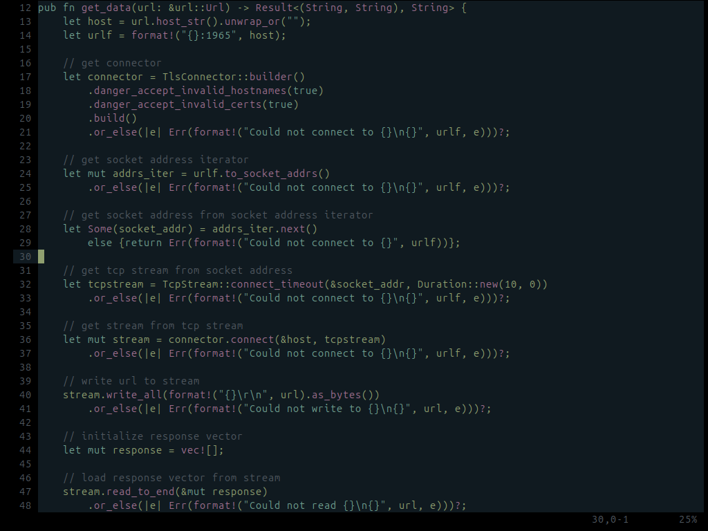
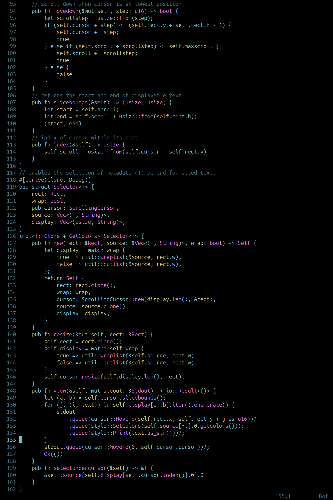

# neovim config

just comment-out what you dont want. see init.lua for the top-level options, or go into the lua directory for finer control.

to use the colorschemes, copy the following heirarchies into your nvim config directory:
- lua/tsad_colorscheme_main.lua
- colors
- queries
- parser

### road
  

### queen
  

### green
  

### cyan
  

### blue
  

### day
  

### moss
  
